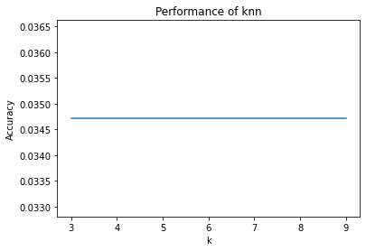
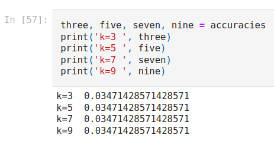
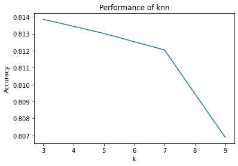
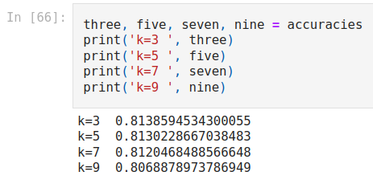
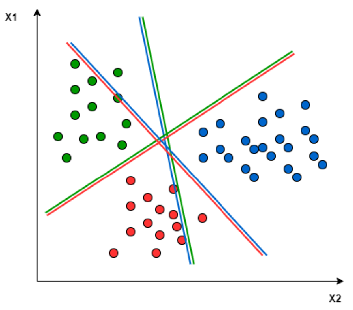
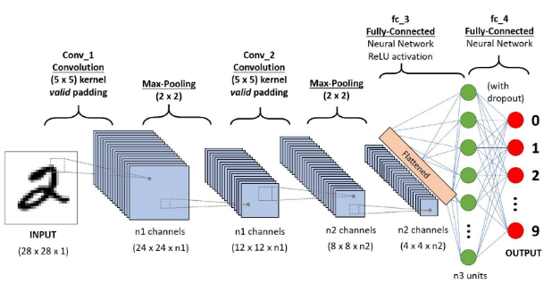

# Sign Language Recognition

## Using machine learning algorithms to recognize sign language.

 | 

### Project Report
- [Report Sign Language Recognition](https://github.com/SpyridonKaperonis/SignLanguageRecognition/blob/main/Pattern_Recognition_and_Classification_Final_Project.pdf)

### Dataset

**Using the [Sign Language MNIST dataset](https://www.kaggle.com/datasets/datamunge/sign-language-mnist)**

- Train data: 27,455 cases
- Test data: 7172 cases
 
### Algorithms

- kNN
1. **Standard Scaler**. Standardize features by removing the mean and scaling to unit variance. 
2. **kNN algorithm**. Implement kNN using two different distance metrics and different number of k-nearest neighbors. 
3. **Training**

- Manhattan distance

 | 

- Euclidean distance

 |

- SVM

- CNN

